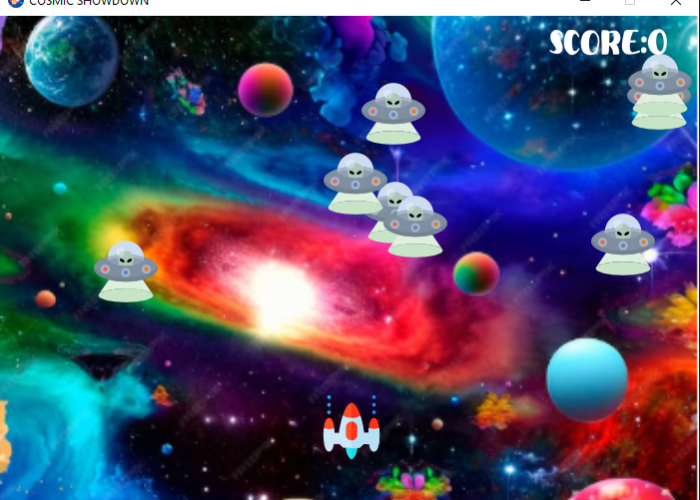
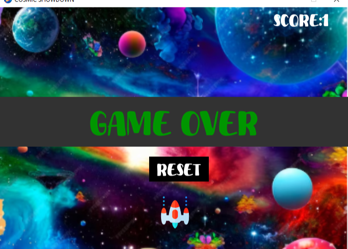

<h1>Cosmic Showdown 🚀</h1>

<i><b>A Space Invaders-inspired game where you defend against alien enemies and aim for the highest score!</b></i>

<h2>Features</h2>
<ul>
<li><b>Dynamic Gameplay:</b>Control your spaceship, fire bullets, and eliminate enemies before they collide with you.</li>
<li><b>Game Over and Reset Options:</b> Reset functionality allows players to restart the game after losing.</li>
<li><b>Realistic Sound Effects:</b> Enjoy background music and sound effects for firing bullets and enemy collisions.</li>
<li><b>Score Tracking:</b> Keep track of your progress with a live score displayed on the screen.</li>
</ul>  
<h2>How to Play</h2>
<ul>
  <li><strong>Move Your Ship:</strong>
    <ul>
      <li>Press the left arrow key (←) to move left.</li>
      <li>Press the right arrow key (→) to move right.</li>
    </ul>
  </li>
  <li><strong>Fire Bullets:</strong>
    <ul>
      <li>Press the spacebar to shoot at enemies.</li>
    </ul>
  </li>
  <li><strong>Avoid Collision:</strong>
    <ul>
      <li>Prevent enemies from reaching your spaceship.</li>
    </ul>
  </li>
  <li><strong>Reset the Game:</strong>
    <ul>
      <li>If you lose, click the RESET button on the screen to start over.</li>
    </ul>
  </li>
</ul>

<h2>Installation</h2>
<ol>
  <li><strong>Clone this repository to your local machine:</strong>
    <pre><code>git clone https://github.com/your-username/cosmic-showdown.git</code></pre>
  </li>
  <li><strong>Install the required dependencies:</strong>
    <ul>
      <li>Python 3.x</li>
      <li>Pygame</li>
    </ul>
    
Install pygame using:

    <pre><code>pip install pygame</code></pre>
  </li>
  <li><strong>Run the game:</strong>
    <pre><code>python cosmic_showdown.py</code></pre>
  </li>
</ol>

<h2>Game Assets</h2>
<ul>
  <li><strong>Background Image:</strong> A starry space-themed image.</li>
  <li><strong>Spaceship Icon:</strong> Represents the player's ship.</li>
  <li><strong>Enemy Icons:</strong> Various alien sprites for enemies.</li>
  <li><strong>Sounds:</strong>
    <ul>
      <li><code>background.wav:</code> Background music.</li>
      <li><code>laser.wav:</code> Bullet firing sound.</li>
      <li><code>explosion.wav:</code> Collision sound.</li>
    </ul>
  </li>
</ul>

<h2>License</h2>

This project is licensed under the <a href="https://opensource.org/licenses/MIT">MIT License</a>.

<h2>Contributing</h2>

We welcome contributions! To contribute:

<ol>
  <li>Fork the repository.</li>
  <li>Create a new branch (<code>feature/your-feature-name</code>).</li>
  <li>Commit your changes.</li>
  <li>Push your branch and create a pull request.</li>
</ol>

<h2>Screenshot</h2>

Here is a preview of the game:

<h2>Acknowledgments</h2>
<ul>
  <li><strong>Pygame Documentation:</strong> For comprehensive references.</li>
  <li><strong>Community Tutorials:</strong> Inspired by space shooter tutorials online.</li>
</ul>
